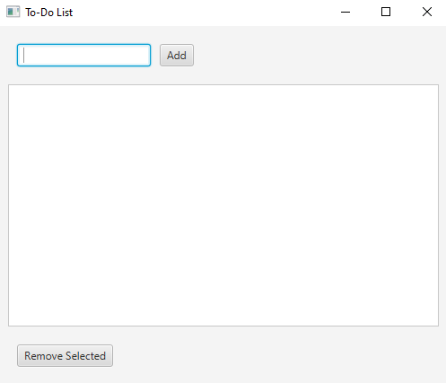

# To-Do List Application

A simple JavaFX-based to-do list application that allows users to add and remove tasks.

## Features

- Add new tasks to your to-do list
- Remove selected tasks
- Clean and intuitive user interface

## Application Screenshot



*The main application window showing the task input field, task list, and remove button.*

## Test Results


*All unit tests passing successfully.*

## How to Run

1. Ensure you have Java and JavaFX installed
2. Open the project in Eclipse or your preferred IDE
3. Run `Main.java` as a Java Application

## How to Run Tests

1. Right-click on `ToDoListModelTest.java`
2. Select "Run As" → "JUnit Test"
3. View test results in the JUnit panel

## Project Structure

```
ToDoListFX/
├── src/
│   ├── application/
│   │   ├── Main.java              # Main application entry point
│   │   ├── ToDoListModel.java     # Business logic and data model
│   │   ├── ToDoListModelTest.java # JUnit tests
│   │   └── application.css        # Styling (optional)
│   └── module-info.java           # Module configuration
└── README.md
```

## Technologies Used

- **JavaFX** - GUI framework
- **JUnit 4** - Unit testing framework
